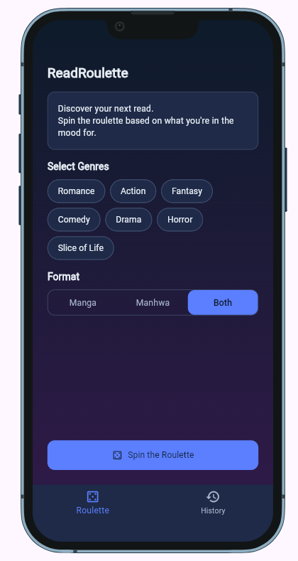
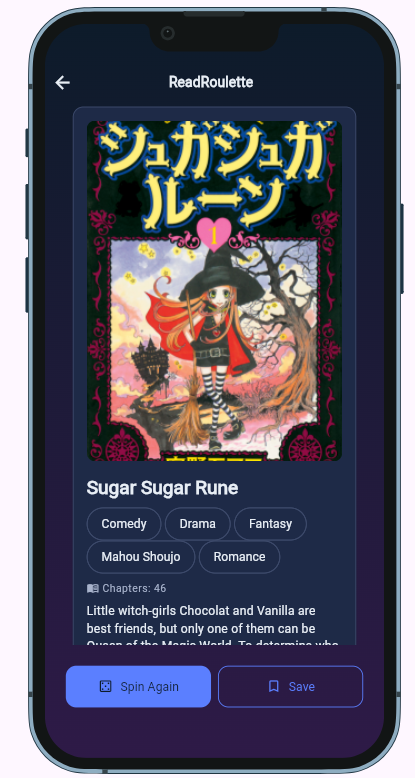
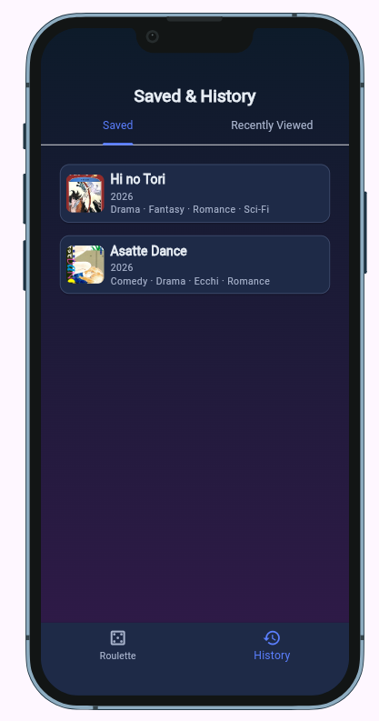

<!--
  This is your project's front page. Replace every placeholder below.
  It is the first thing your instructor and any future employer will read, and
  the live link in it is how your project gets opened for grading.

  New here? Read START-HERE.md first. Delete this comment when you are done.
-->

# ReadRoulette

> ReadRoulette instantly picks the perfect manga or manhwa from your custom filters so you can stop overthinking and start reading!

**Live demo:** https://Dodz24.github.io/ReadRoulette/ <!-- GitHub Pages is set up already; replace if you host elsewhere -->

**Demo video:** `docs/demo.mp4` (link it here once it exists)

**Course:** Applications Development and Emerging Technologies (6ADET), Holy Angel University

**Author:** Dodz24

This repository lives in the author's own GitHub account and is public on
purpose. There is no `student.json` here and there should not be one: see
`docs/06-security-and-privacy.md` for what a public repo means for secrets and
personal data.

---

## Screenshots

Put two or three real screenshots at phone size in `docs/assets/`, then replace
this paragraph with them:

```markdown
| Home | Results | Saved & History |
| --- | --- | --- |
|  |  |  |
```

A repo without screenshots reads as abandoned, whatever the code says.

## What it does

Three to five bullets. What can a user actually do?

- Lets users choose one or more manga/manhwa genres such as Romance, Action, Fantasy, Comedy, Drama, Horror, and Slice of Life.
- Lets users filter between Manga, Manhwa, or Both.
- Uses the AniList GraphQL API to randomly recommend a title based on the selected filters.
- Shows the recommended title's cover, title, genres, chapter count, country of origin, and synopsis.
- Lets users spin again, save titles, and view recently viewed titles.

## Built with

| | |
| --- | --- |
| Framework | Flutter (Dart) |
| State | `setState` |
| API | AniList GraphQL API |
| HTTP | http |
| Storage | shared_preferences |
| Device preview | device_preview |
| UI | Material 3 |
| Deployment | GitHub Pages |


## Project Structure

```
lib/
├── main.dart
├── theme.dart
├── models/
│   └── manga_title.dart
├── screens/
│   ├── home_filter_screen.dart
│   ├── result_screen.dart
│   ├── root_shell.dart
│   └── saved_history_screen.dart
├── services/
│   └── anilist_service.dart
├── storage/
│   └── title_store.dart
└── widgets/
    ├── back_arrow_button.dart
    ├── bottom_nav_bar.dart
    ├── format_toggle.dart
    ├── genre_chip.dart
    ├── list_item_card.dart
    ├── primary_button.dart
    └── result_card.dart
```

## Running it yourself

Make sure Flutter is installed, then run:

  `flutter pub get`
  `flutter run -d chrome`

- The project does not require an .env file or an API key.

- The app uses the public AniList GraphQL API for manga and manhwa data

### Environment variables

- This project does not currently use environment variables.

- No API key or secret is required to access the AniList GraphQL API used by ReadRoulette.


## Privacy and secrets

- ReadRoulette does not require users to create an account or provide personal information. Saved titles and recently viewed titles are stored locally on the user's device using shared_preferences.

- The app does not store API keys or private credentials. It requests manga and manhwa information from the public AniList GraphQL API.

- Sample data, screenshots, and the project video should not contain real personal information.

## Project documentation

| Document | |
| --- | --- |
| [Proposal](docs/01-proposal.md) | the problem, the users, the scope |
| [Mockup and wireframes](docs/02-mockup.md) | what it looks like, and the screen flow |
| [Design system](docs/03-design-system.md) | colors, type, spacing, components |
| [Weekly reports](docs/04-weekly-reports.md) | what happened each week |
| [Demo video](docs/05-demo-video.md) | the recording and what it shows |
| [Start here](START-HERE.md) | how this repo works (delete once you have read it) |
| [Security and privacy](docs/06-security-and-privacy.md) | the checklist, filled in |

## Status and what is next

- The main ReadRoulette features are working, including genre and format filtering, random title recommendations, result details, saving titles, and recently viewed history.

- The project is currently being finalized for the 6ADET final presentation.


## Possible future improvements include:

- More filtering options
- Better recommendation logic
- More detailed title information
- Better organization of saved titles
- Additional discovery features

## Credits

- AniList: Provides the manga and manhwa data through its public GraphQL API.
- Packages: See pubspec.yaml for the complete list of dependencies.
- AI assistance: Claude and ChatGPT were used as development assistants. See AI-USAGE.md for the complete disclosure.

## AI use

I used Claude as development assistant while building ReadRoulette. They helped with Flutter implementation, reusable widgets, API integration, local storage, debugging, testing, and reviewing code. I reviewed and modified the suggestions to fit the project and worked on understanding the code and how the different parts of the app connect.


- For the complete disclosure, including specific examples of AI assistance, mistakes, and my own contributions, see [AI-USAGE.md](AI-USAGE.md).

## Licence

MIT, see [LICENSE](LICENSE). Change it if you want different terms.
